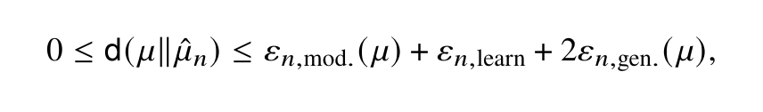



**X-Student Research Group · TU Berlin · Summer term 2027**
*Funded by the Berlin University Alliance. Open to Bachelor's and Master's students. 6–15 participants.*

Deep neural networks are among the most widely used function approximation tools in science and industry — and we still cannot fully explain why they learn as well as they do. This research group takes that gap seriously and works on it starting from a rigorous entry point.

Over one semester we will assemble, module by module, a complete error analysis for **two-layer ReLU networks** — and find out exactly where the theory stops.

## The guiding question

> How large is the total excess risk of a two-layer ReLU network trained by SGD, and how does it decompose into approximation, generalization and optimization components?

The mathematical study of learning splits the excess risk into three sources of error:

| | Error | What it measures |
|---|---|---|
| (i) | **Approximation** | How well the network class can represent the target function at all |
| (ii) | **Generalization** | Statistical fluctuation from having only finitely many training samples |
| (iii) | **Optimization** | The gap between the best network in the class and the one SGD actually finds |

The first two components are relatively well understood and have entered textbook treatments. The third has not. Proving that stochastic gradient descent converges to an empirical risk minimizer is, for realistic architectures, **an open problem** — and there are results showing that in general it plainly fails to. Rigorous positive results do exist, but only under strict specifications: over-parametrized two-layer networks, the neural tangent kernel regime, one-pass SGD. How the optimization gap really depends on width, sample size, step size and data distribution is not yet fully characterized.

That is why the two-layer setting is the right place to work. The restriction is not pedagogical convenience: it is the class for which the most complete positive results are available, and the class in which the boundary between "understood" and "not yet understood" can be drawn most precisely.

**Why it matters.** Scientifically, closing the gap between the empirical success of SGD and its theoretical guarantees is a central open problem in learning theory and optimization. Practically, knowing when and why networks generalize — and when they fail to — is a prerequisite for deploying them in medicine, engineering and public policy. The project connects directly to my own work on statistical learning theory for deep learning ([NeuralODE error analysis](https://arxiv.org/abs/2503.10729), [consistency of learned quadrature rules](https://arxiv.org/abs/2507.01533)) and to the lecture series *Mathematical Foundations of Machine Learning* at TU Berlin.

## How the group works

The X-Student Research Group is a **collaborative research seminar**. Instead of having weekly talks about book chapters and papers, we will work together on a single research question. The project is modular: each module is a self-contained mathematical problem that contributes to the overall goal. Each module has a reading list of primary and secondary sources, and a set of open questions to work on. You will work in small groups reading, presenting and discussing the material, *doing* mathematics and contributing to the numerical experiments. The modules are designed to be interdependent: no single participant can command the full picture alone.
Expect roughly 2–3 hours of independent reading per week between sessions.

## Who can join

The group is open to Bachelor's and Master's students in mathematics or closely related programs — scientific computing, computer science, physics. The expected background is foundational coursework in:

- Real analysis / measure theory (at least a first course)
- Probability theory (at least an introductory course)
- Linear algebra
- Numerics / scientific computing, with basic Python (or comparable) programming skills

**No prior knowledge of machine learning, neural networks or deep learning is required. Heterogeneous backgrounds are planned for, not merely tolerated.**

**Format.** Weekly 90-minute group sessions, subgroups of 2–5, 6–15 participants in total. The workload is comparable to a regular 2-SWS seminar — roughly 4–6 hours per week including reading, discussion and coding.

Interested, or unsure whether your background fits? [Feel free to send me an email](mailto:riedlinger@math.tu-berlin.de).

<!-- ## Starting points in the literature

*Framework.* Beck, Jentzen & Kuckuck, *Full error analysis for the training of deep neural networks*, Infin. Dimens. Anal. Quantum Probab. Relat. Top. 25(02), 2022. — Shalev-Shwartz & Ben-David, *Understanding Machine Learning: From Theory to Algorithms*, Cambridge University Press, 2014.

*Approximation.* Barron, *Universal approximation bounds for superpositions of a sigmoidal function*, IEEE Trans. Inf. Theory 39(3), 1993. — Goebbels, *On sharpness of error bounds for single hidden layer feedforward neural networks*, 2020. — Grohs, Ibragimov, Jentzen & Koppensteiner, *Lower bounds for artificial neural network approximations*, J. Complexity 77, 2023.

*Generalization.* Neyshabur, Li, Bhojanapalli, LeCun & Srebro, *The role of over-parametrization in generalization of neural networks*, ICLR 2019. — Berner, Grohs & Jentzen, *Analysis of the generalization error*, SIAM J. Math. Data Sci. 2(3), 2020.

*Optimization.* Li & Yuan, *Convergence analysis of two-layer neural networks with ReLU activation*, NeurIPS 2017. — Zhu & Xu, *One-pass stochastic gradient descent in overparametrized two-layer neural networks*, AISTATS 2021. — Xu & Zhu, *Overparametrized multi-layer neural networks: uniform concentration of NTK and convergence of SGD*, JMLR 25(94), 2024. — Frostig et al., *Competing with the empirical risk minimizer in a single pass*.

*Where it fails.* Cheridito, Jentzen & Rossmannek, *Non-convergence of stochastic gradient descent in the training of deep neural networks*, J. Complexity 64, 2021. — Do, Hannibal & Jentzen, *Non-convergence to global minimizers in data driven supervised deep learning*, J. Math. Anal. Appl., 2026.

*Connected work by the group leader.* Ehrhardt, Gottschalk & Riedlinger, [*Numerical and statistical analysis of NeuralODE with Runge–Kutta time integration*](https://arxiv.org/abs/2503.10729), 2025. — Gottschalk, Partow & Riedlinger, [*Consistency of learned sparse grid quadrature rules using NeuralODEs*](https://arxiv.org/abs/2507.01533), 2025. -->
