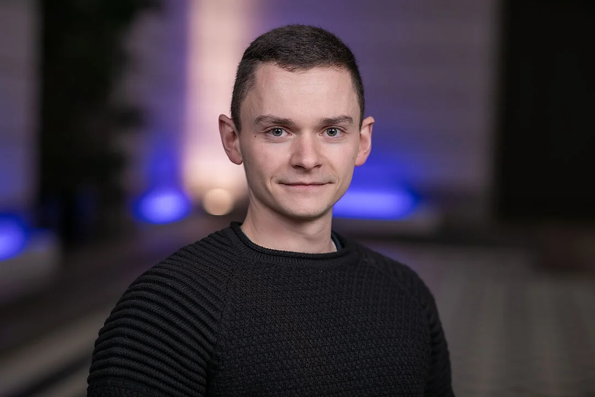



Hi, I'm Tobias. I work on the mathematical foundations of machine learning, with a particular interest in reliable AI, uncertainty quantification, statistical learning theory, and generative models. I enjoy theory that connects to practical machine learning problems in a clear and rigorous way.

# Research
- **Reliable AI and Uncertainty Quantification** - When can we trust a model and what are how can we tell when we should not?
- **Statistical Deep Learning** - Which guarantees can we prove about learning, generalization and structure in modern models?
- **Data Curation and Active Learning** - How can we identify defective annotations, improve data quality and better use of data pools?

# Selected Publications
> **Towards Reliable Detection of Empty Space: Conditional Marked Point Processes for Object Detection**
> Tobias Riedlinger, Kira Maag and Hanno Gottschalk

> **Lmd: Light-weight prediction quality estimation for object detection in lidar point clouds**
> Tobias Riedlinger, Marius Schubert, Sarina Penquitt, Jan-Marcel Kezmann, Pascal Colling, Karsten Kahl, Lutz Roese-Koerner, Michael Arnold, Urs Zimmermann, and Matthias Rottmann

> **Gradient-Based Quantification of Epistemic Uncertainty for Deep Object Detectors**
> Tobias Riedlinger, Matthias Rottmann, Marius Schubert, and Hanno Gottschalk

# News
- 17.03.2026 Contributed Session Talk at GAMM 2026 (16.03.-20.03., Stuttgart)
- 25.02.2026 - 27.02.2026 nxtAIM Open Project Day and Winter School II (Freiburg im Breisgau)

# Teaching and Mentoring
I enjoy teaching and mentoring students in mathematics and machine learning.
Here are some ongoing thesis projects:
- Studies on the Regularity Theory of the Flow Matching Vector Field
- Conditional Marked Poisson Point Process Networks for Synthetic Radar Point Cloud Generation
- Symmetries and Moduli Spaces of Deep Neural Networks

# Contact
- Email: [riedlinger@tu-berlin.de](mailto:riedlinger@tu-berlin.de)
- Office: +49 202 314 25062
- Scholar: [Tobias Riedlinger](https://scholar.google.de/citations?user=XggH5bwAAAAJ)