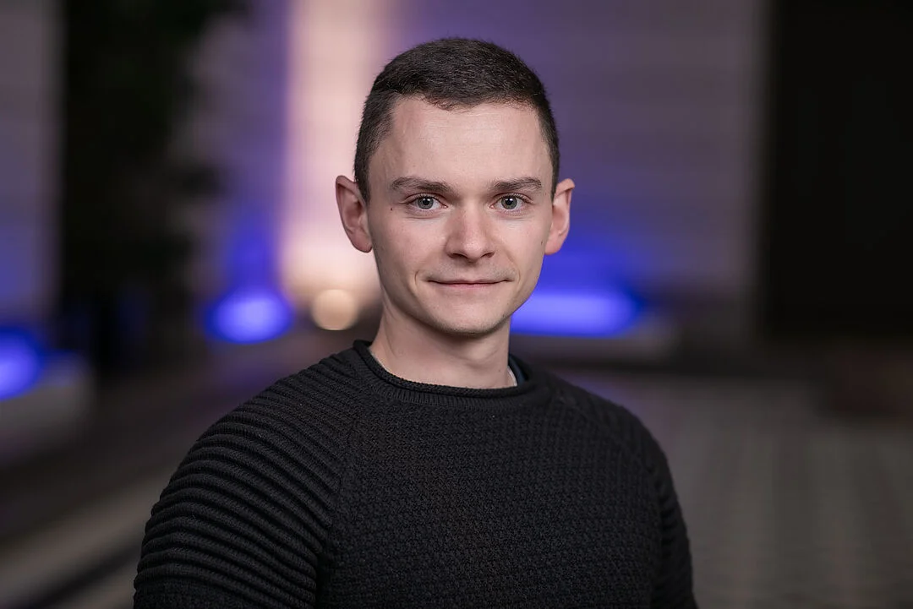



  
  

    

      <strong>Dr. rer. nat. Tobias J. Riedlinger</strong> 
      Postdoctoral Researcher, Institute of Mathematics, TU Berlin 
      Group: Mathematical Modeling of Industrial Life Cycles
    

    

      I work on the mathematical foundations of machine learning. My research asks when deep learning systems admit provable guarantees — and, where guarantees are out of       reach, how to measure rigorously what a model does not know.
    

    

      <a href="assets/cv.pdf">CV (PDF)</a> ·
      <a href="https://scholar.google.de/citations?user=XggH5bwAAAAJ">Google Scholar</a> ·
      <a href="https://orcid.org/0000-0002-1953-8607">ORCID</a> ·
      <a href="https://github.com/tobiasriedlinger">GitHub</a> ·
      <a href="mailto:riedlinger@math.tu-berlin.de">riedlinger@math.tu-berlin.de</a>
    

  

## Research

My work spans statistical learning theory, optimal transport and applied uncertainty quantification, held together by one question: **What can we actually prove about modern learning systems, and what do we do about the rest?**

- **Statistical Learning Theory for Deep Learning** — Which guarantees can we prove about learning, generalization and structure in modern models? Recent results give a numerical and statistical analysis of NeuralODEs under Runge–Kutta integration, and consistency of learned sparse-grid quadrature rules.
- **Generative Models and Synthetic Data** — What can be proven about the transport maps generative models learn, and what happens when models are trained on their own output? Recent work establishes existence and Hölder regularity of transport vector fields and their flows for Beckmann's parametric optimal transport problem.
- **Reliable AI and Uncertainty Quantification** — When can we trust a model, and how can we tell when we should not? I develop gradient- and output-based uncertainty estimates for object detection and segmentation, and probabilistic models that let a detector state that *nothing is there*.
- **Data Curation and Active Learning** — How can we identify defective annotations in large-scale datasets, and how do we spend an annotation budget well?

[More on my research →](research.md)

## Selected Publications

> 📑 **Towards Reliable Detection of Empty Space: Conditional Marked Point Processes for Object Detection**
> ***Tobias J. Riedlinger**, Kira Maag, and Hanno Gottschalk.*
> International Conference on Learning Representations (ICLR), 2026
>
> [arXiv](https://arxiv.org/abs/2506.21486) | [PDF](https://openreview.net/pdf?id=M2KLWLHzX0) | [Code](https://github.com/CMPPP-CV/cmpppnet)

> 📄 **Regularity of Solutions to Beckmann's Parametric Optimal Transport**
> *Hanno Gottschalk and **Tobias J. Riedlinger**.*
> Preprint, 2026 (under review)
>
> [arXiv](https://arxiv.org/abs/2603.19755) | [PDF](https://arxiv.org/pdf/2603.19755)

> 📘 **LMD: Light-weight Prediction Quality Estimation for Object Detection in Lidar Point Clouds**
> ***Tobias J. Riedlinger**, Marius Schubert, Sarina Penquitt, Jan-Marcel Kezmann, Pascal Colling, Karsten Kahl, Lutz Roese-Koerner, Michael Arnold, Urs Zimmermann, and Matthias Rottmann.*
> International Journal of Computer Vision (2025), pages 4349–4365
>
> [Paper](https://link.springer.com/article/10.1007/s11263-025-02377-8) | [PDF](https://rdcu.be/ebLjA) | [Code](https://github.com/JanMarcelKezmann/MetaDetect3D)

> 📑 **Gradient-Based Quantification of Epistemic Uncertainty for Deep Object Detectors**
> ***Tobias J. Riedlinger**, Matthias Rottmann, Marius Schubert, and Hanno Gottschalk.*
> Proceedings of the IEEE/CVF Winter Conference on Applications of Computer Vision (WACV), 2023, pages 3921–3931
>
> [Paper](https://openaccess.thecvf.com/content/WACV2023/html/Riedlinger_Gradient-Based_Quantification_of_Epistemic_Uncertainty_for_Deep_Object_Detectors_WACV_2023_paper.html) | [PDF](https://openaccess.thecvf.com/content/WACV2023/papers/Riedlinger_Gradient-Based_Quantification_of_Epistemic_Uncertainty_for_Deep_Object_Detectors_WACV_2023_paper.pdf) | [Code](https://github.com/tobiasriedlinger/gradient-metrics-od)

[Full list of publications →](publications.md)

## Supervision, Teaching and Service

- **Supervision** — I co-supervise one PhD project (*Quality Assessment of Generative Models and Synthetic Data*, with Hanno Gottschalk) and have supervised a number of **Bachelor's and Master's theses since 2024**, split roughly evenly between mathematical theory and applied model development. [Overview of supervised projects →](teaching.md)
- **Teaching** — Instructor and organizer of two graduate mathematics seminars at TU Berlin (*Mathematical Perspectives on Machine Learning Algorithms*, 2026; *Uncertainty Quantification in Machine Learning*, 2025), alongside a number of courses as teaching assistant in Berlin, Wuppertal and Tübingen, ranging from numerical linear algebra and high-dimensional probability to mathematical statistical physics.
- **Academic service** — Referee and program committee member for NeurIPS 2026, AAAI 2026, KI 2026, BMVC 2024 and VISAPP 2024 (also session chair); referee for *IEEE Transactions on Image Processing*.
- **Talks and visits** — Contributed talk at GAMM 2026 (Stuttgart); oral presentations at VISAPP 2024 (Rome) and WACV 2023 (Waikoloa). Research visits to the University of Zagreb in 2024 and 2025, hosted by Siniša Šegvić and Anja Delić.

## News

- **23 Apr 2026** — Poster presentation of [Towards Reliable Detection of Empty Space: Conditional Marked Point Processes for Object Detection](https://openreview.net/forum?id=M2KLWLHzX0) at [ICLR 2026](https://iclr.cc/Conferences/2026) (23–27 April, Rio de Janeiro)
- **23 Mar 2026** — New preprint online: [Regularity of Solutions to Beckmann's Parametric Optimal Transport](https://arxiv.org/abs/2603.19755). We show existence and Hölder regularity of transport vector fields and their flows under relatively generic conditions.
- **17 Mar 2026** — Contributed talk *Hölder Regularity of Solutions to the Beckmann Problem with Quadratic Cost* at GAMM 2026 (16–20 March, Stuttgart)
- **25 Feb 2026** — nxtAIM Open Project Day and Winter School II (25–27 February, Freiburg im Breisgau)

## Contact

- **Email:** [riedlinger@math.tu-berlin.de](mailto:riedlinger@math.tu-berlin.de)
- **Office phone:** +49 30 314 1900 1014
- **Google Scholar:** [Tobias Riedlinger](https://scholar.google.de/citations?user=XggH5bwAAAAJ) 
- **ORCID:** [0000-0002-1953-8607](https://orcid.org/0000-0002-1953-8607)
