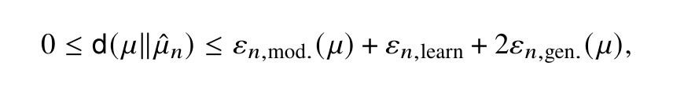
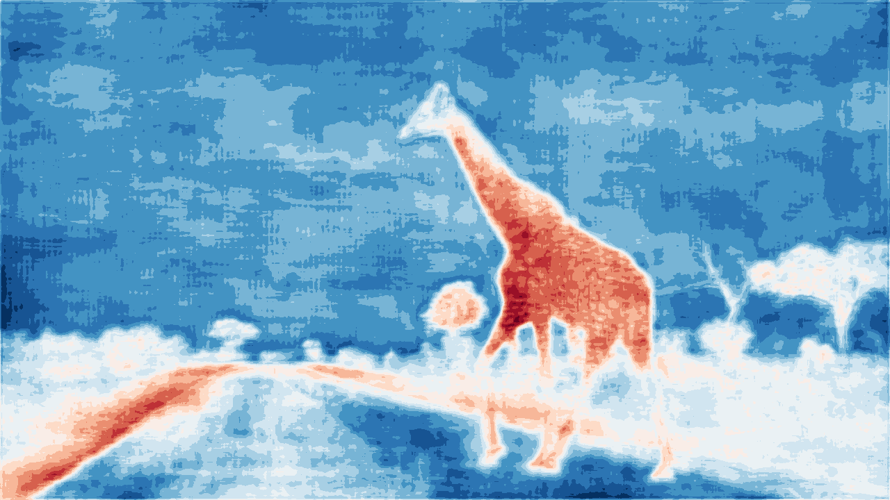
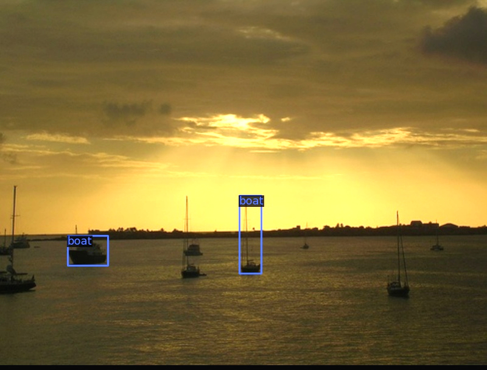
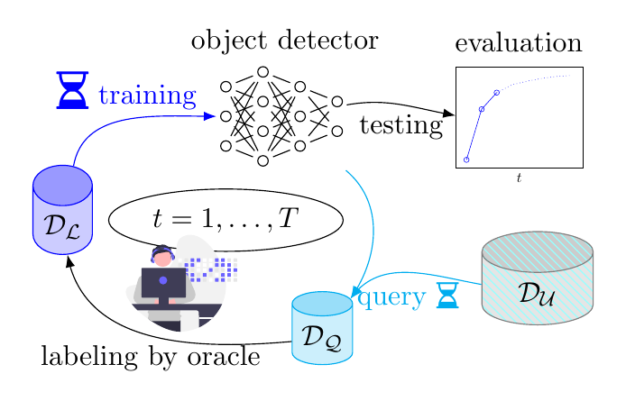



My research generally lies at the intersection of mathematics and machine learning. The unifying question is what we can actually prove about modern learning systems — and what to do where proofs are out of reach.

## Statistical Learning Theory for Deep Learning
So far from my point of view the most convincing and sensible notion of successful learning: **P**robably **A**pproximately **C**orrect learning captures that training data is drawn from a probability distribution covering worst case scenarios.
Proving PAC learnability for deep learning models involves a variety of mathematical tools and requires understanding their interplay and connections.
Concretely, this has led to a numerical and statistical analysis of NeuralODEs under Runge–Kutta time integration and to consistency results for learned sparse-grid quadrature rules.

## Generative Models and Synthetic Data
Generative models learn to transport one distribution onto another, which makes them a natural object for analysis by optimal transport and regularity theory.
I study what can be proven about the maps and vector fields these models learn: recent work with Hanno Gottschalk establishes existence and Hölder regularity of transport vector fields and their flows for Beckmann's parametric optimal transport problem.
A second thread asks what happens once synthetic data feeds back into training — when models are trained on their own output, or when a network fails to learn from artificial data at all.

## Reliable AI and Uncertainty Quantification
Neural networks are great. It is uncomfortable to admit, but they do some things better than I. But they are also bad at knowing when they don't know something. This research direction addresses this shortcoming by developing methods to quantify the uncertainty of model predictions and safety mechanisms.

<!-- Read more [here](docs/reliable_ai_and_uncertainty_quantification.md). -->

## Data Curation and Active Learning
I was looking through failure cases of a deep object detection model in order to understand why its performance was worse than we expected.
To my surprise, the model was actually right in many cases where it was penalized for being wrong: the ground truth annotations were simply missing. This led me to investigate systematic methods for discovering annotation errors introduced by human labelers in large-scale datasets.
As a related discipline, I investigate how to smartly use annotation budgets in the context of active learning.

